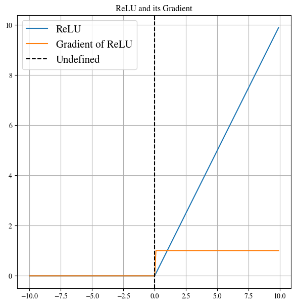
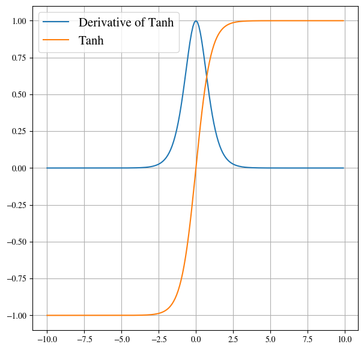
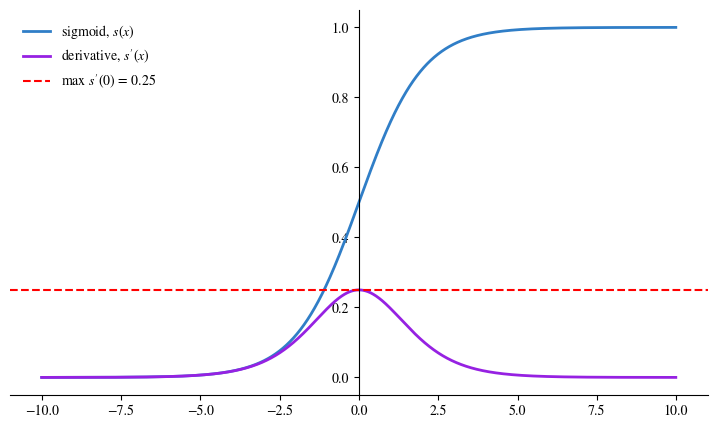
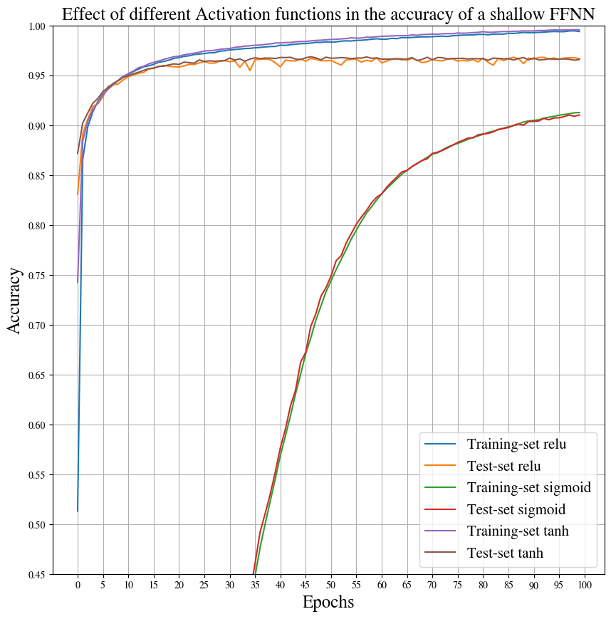
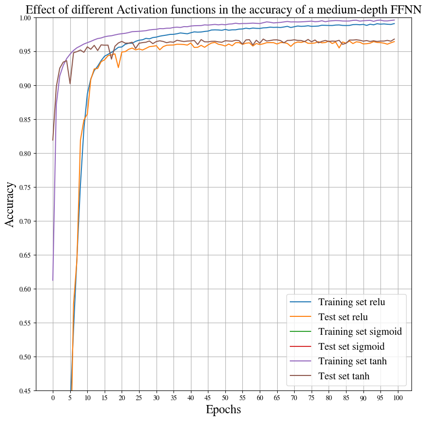
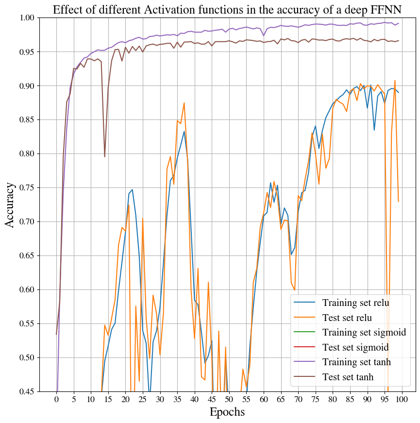
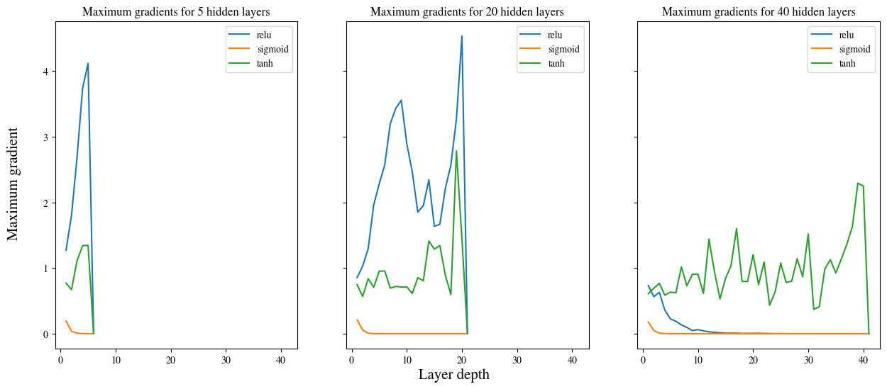

This work is one of a series of three distinct repositories that collectively constitute the coursework focused on Neural Networks for the Μ124 - Machine Learning course at the National and Kapodistrian University of Athens (NKUA) during the Fall 2022 semester. The other two repos deal with [Adversarial Neural Networks (ANN)](https://github.com/KyriakosPsa/Neural-Networks-Adversarial-Examples) and [Emotion-recognition using a Convolutional Neural Network (CNN)](https://github.com/mdarm/machine-learning-coursework).

# Neural Network Activation Function Analysis

This work is one of a series of three distinct repositories that collectively constitute the coursework focused on Neural Networks for the Data Science & Information Technologies masters course: Μ124 - Machine Learning at the National and Kapodistrian University of Athens (NKUA) during the Fall 2022 semester. The remaining repositories are:
- [Neural Network Adversarial Examples](https://github.com/KyriakosPsa/Neural-Networks-Adversarial-Examples)
- [Facial Expression Recognition (FER)](https://github.com/mdarm/machine-learning-coursework/blob/main/notebooks/ml_2_ex_3.ipynb)

This specific repository presents an analysis of various activation functions in the context of Multi-Layer Perceptrons (MLPs), trained on the MNIST dataset of handwritten digits. It provides a study of the behavior of these functions regarding their gradients, and their impact on the learning process and model performance.

# Overview

The following tasks have been performed in the included notebook:

- **Task A:** The backpropagation equations have been rewritten for specific activation functions: ReLU, hyperbolic tangent, and sigmoid. The range of gradients for each activation function has also been provided. Below we present the visualization of the activation functions and their gradients.

  <b>ReLU:</b>

  

  <b>Tanh:</b>

  

  <b>Sigmoid:</b>

  

---

- **Task B:** The MNIST dataset was used to train a fully-connected neural network to recognize handwritten digits. A comparison study was carried out by varying the number of layers (5, 20, and 40) and activation functions (ReLU, hyperbolic tangent, sigmoid) used in the model.The corresponding test scores for each model were reported, along with insightful observations. Again below we showcase the visualization of the test accuracy scores per epoch for all activation functions and layer depths, to illustrate the vanishing gradient problem.

<b>Shallow network:</b>

  

  <b>Medium depth Network:</b>

  

  <b>Deep Network:</b>

  

- **Task C:** For each model trained in Task B, the maximum gradient value for each layer was calculated for a given mini-batch. A plot showcasing the correlation between layer depth and maximum gradient was created, offering visualization and analysis of the results.

  <b>layer depth vs maximum gradient:</b>

  

- **Task D:** A model was trained using the given the architecture from Task B, but with the LeCun activation function. An analysis was performed between the learning curves of models using the LeCun and hyperbolic tangent activation functions. Further, the backpropagation equations and the gradient range for the LeCun activation function were derived. Finally, the gradients for different depth choices were plotted for an untrained model using LeCun and hyperbolic tangent activations.

  <b>LeCun activation vs tanh:</b>

  

